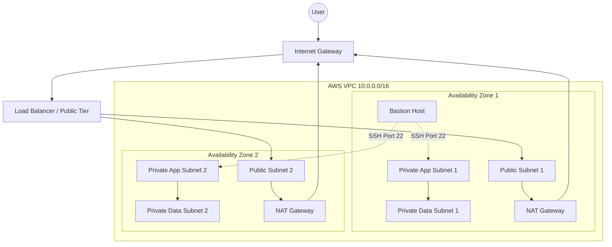

# Secure and Scalable Multi-Tier VPC Foundation
This project uses Terraform to deploy a production-grade, 3-tier network architecture in AWS. It is designed for High Availability across two Availability Zones and implements network isolation.

## Architecture Diagram

