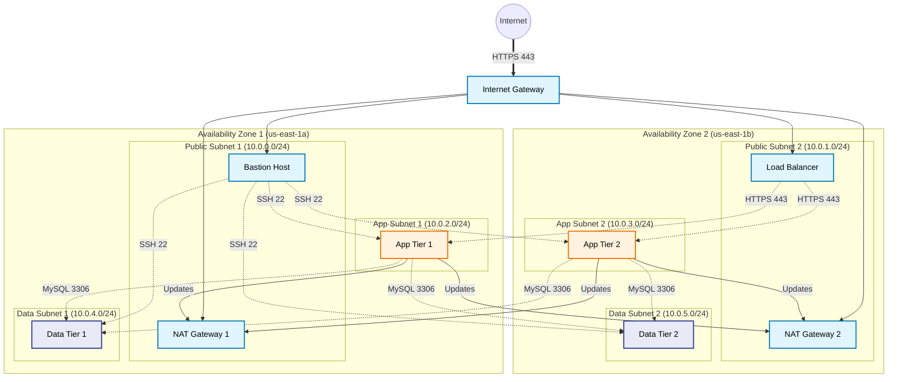

# Secure and Scalable Multi-Tier VPC Foundation
This project uses Terraform to deploy a production-grade, 3-tier network architecture (Web, App, Data) in AWS. Terraform is used to define the Infrastructure as Code (IaC) and is designed for High Availability across two Availability Zones and implements network isolation.

## Architecture Diagram

Implemented using: https://www.mermaidchart.com/

## Security Configurations

1. The VPC is divided into three distinct tiers:

- Public Tier: Hosts the Bastion and NAT Gateways. It has a route to the Internet Gateway.

- Private App Tier: Hosts app logic. It has no direct route to the internet and it uses NAT Gateways for outbound updates.

- Private Data Tier: Hosts databases. It is completely isolated and accepts traffic only from the App Tier.

2. Security Groups

- Bastion SG: Allows SSH only from specific admin IP. (User needs to change to their IP for it to work)

- App SG: Refuses all traffic unless it is from the Load Balancer SG or Bastion SG.

- Data SG: Refuses all traffic unless it is from the App SG.

3. Network ACLs

- Public NACL: Allows internet traffic on SSH.

- Private NACL: Restricts ingress traffic. It only allows traffic coming from VPC CIDR block (10.0.0.0/16). This allows for no external internet traffic that affects the App or Data subnets.

### Contact Information
- Email: abinswar7@gmail.com
- LinkedIn: https://www.linkedin.com/in/aveinn-swar/